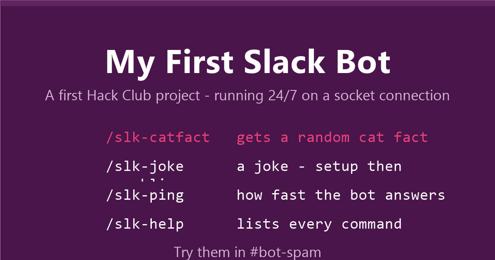

# My First Slack Bot

<!--
TODO: project banner here. Replace the line below with a screenshot of your bot running in Slack, e.g.

-->

A Slack bot I made while learning Node.js, and my first Hack Club project. Before this I'd only followed tutorials, so this is the first thing I got genuinely working in a real workspace.

## What it does

The bot listens for a few slash commands in any channel where it's been added:

- `/slk-catfact` – replies with a random cat fact (no setup, straight to the point)
- `/slk-joke` – replies with a joke, setup first and the punchline on the next line
- `/slk-ping` or `/slk` – tells you the bot is alive and how fast it answered in ms
- `/slk-help` – lists all of the above so nobody has to remember them

## Try it

The bot is running 24/7 in my workspace. If you're in it, just type one of the commands above in the demo channel.

## How to run it yourself

You'll need Node.js and a Slack app with Socket Mode enabled. Grab a Bot token and an App token from the Slack API dashboard, then:

1. `npm install`
2. Copy `.env.example` to `.env` and drop your two tokens in
3. `npm start`

When it connects you'll see `bot is running!` printed in the terminal.

## Some notes

- It uses Slack's Bolt SDK in Socket Mode, so Slack pushes events to the bot over a websocket. That means no public server, no ngrok, nothing — it just runs on a laptop.
- Every command has to call `ack()` quickly or Slack gives up on the request and shows a timeout error. That bit me on the first version.
- If a third-party API is down the bot replies with a short "couldn't fetch" message instead of crashing.